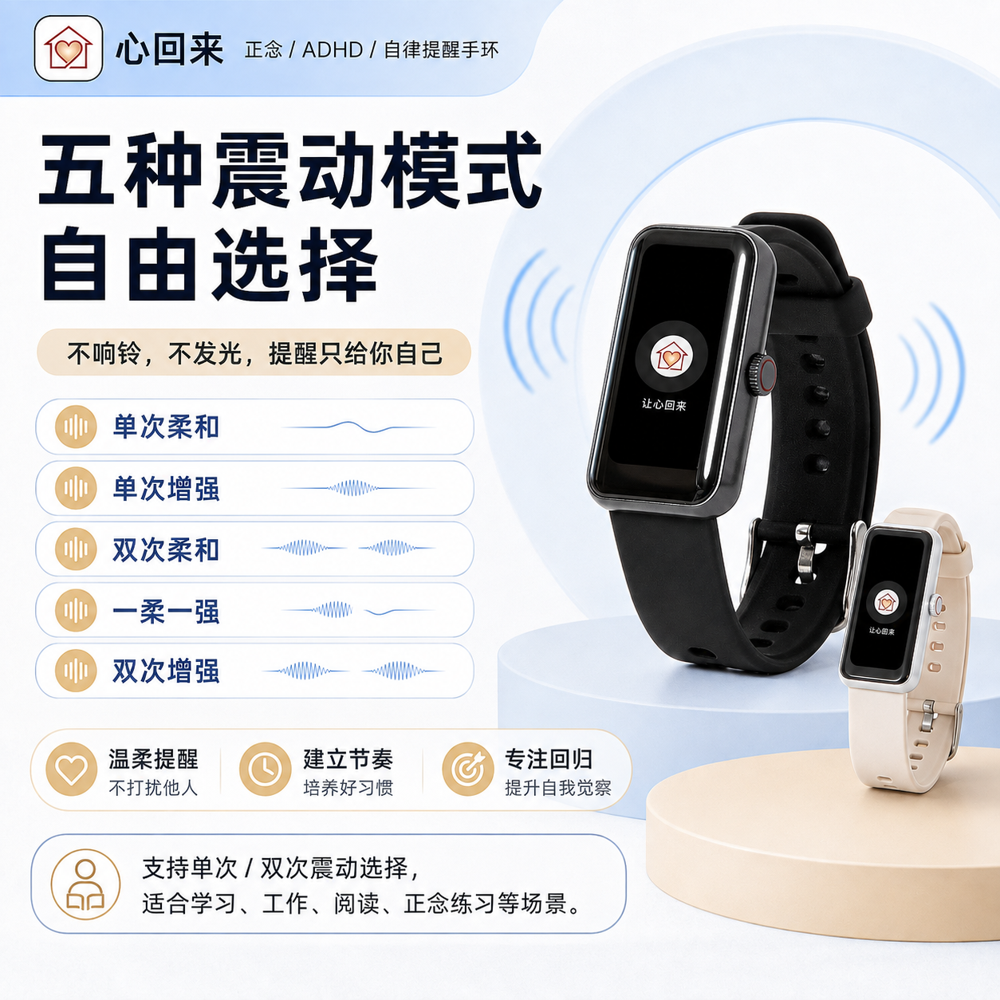

# 心回来 (Xinhuilai) · Android 官方客户端

<div align="center">
  
  <h3>让分心的人，随时「回到当下」</h3>
  <p><b>广州觉见科技有限公司 (Guangzhou Juejian Technology Co., Ltd.) 官方开源工程</b></p>
  <p>
    <a href="https://www.awansight.com">官方网站 (awansight.com)</a> •
    <a href="https://www.awansight.com/xinhuilai/">手环使用说明书</a> •
    <a href="https://github.com/sinianchu9/xinhuilai_ios">iOS SDK</a> •
    <a href="https://github.com/sinianchu9/WeChat_Mini_Program_Ble_SDK">微信小程序 SDK</a>
  </p>
  <p>
    
    
    
    
    
  </p>
</div>

---

## 1. 项目概述

本工程是 **广州觉见科技有限公司** 为旗下核心自研硬件 **「心回来」正念 / ADHD / 自律提醒智能手环** 打造的官方 Android 客户端与 BLE 交互管理系统。

在当今算法投喂与屏幕泛滥的时代，心回来手环秉持 **「把提醒放到手腕上，而不是把分心交给手机」** 的产品哲学。用户在手机 App 完成一次定时节律与震动模式配置后，手环即可 **100% 长期离线自主运行**，无需 Wi-Fi 或持续蓝牙连线，以不响铃、不发光、免打扰他人的物理静音体感，打断走神沉迷，温柔守护专注。

<div align="center">
  
  
</div>

---

## 2. 核心功能与技术特性

### 2.1 专注节律与自律干预 (ReminderFragment)
- **1~180 分钟精准循环节律**：自由适配专注场景（1-10分钟正念冥想、15-30分钟考研刷题、25-60分钟番茄深度工作、90-180分钟长时陪伴）。
- **0:00 - 24:00 运行窗口**：支持精确设定每日起止时间段（如 08:00 - 22:00）。
- **五种物理静音震动模式**：
  1. `单次柔和`：如清风拂过腕部，适合安静阅读与思考。
  2. `单次增强`：明确触感，适合课堂与开会防困。
  3. `双次柔和`：轻触两下，适合阶段性任务切换。
  4. `一柔一强`：复合触感节奏，强化身心唤醒。
  5. `双次增强`：高强度物理拉回，专为重度走神与 ADHD 冲动阻断设计。

### 2.2 全天候高精度生理监测 (HealthDataFragment)
- **高精光学传感器**：实时采集并同步心率、血氧饱和度、体表温度、睡眠深度分期与每日计步。
- **离线数据追溯**：手环内部 Flash 具备多日数据缓冲能力，重新连接蓝牙即可秒级回传同步。

### 2.3 硬件状态与通用控制 (SettingsFragment)
- **极简常灭屏模式**：关闭屏幕唤醒，最大化杜绝蓝光与视线干扰，手环续航提升至数周。
- **表盘切换与硬件复位**：支持表盘样式同步与出厂状态恢复。

---

## 3. 架构设计与工程实现

本项目采用现代化 **单 Activity + 多 Fragment (Jetpack Navigation / FragmentContainerView)** 响应式架构：

```
├── app/src/main/java
│   └── com/xinhuilai/bracelet
│       ├── MainActivity.kt                # 主宿主容器，统一管理底部导航与生命周期
│       ├── ui/
│       │   ├── ConnectFragment.kt         # BLE 设备发现、MAC 绑定与密码鉴权 (默认 0000)
│       │   ├── ReminderFragment.kt        # 循环周期 (1-180min) 与五种震动指令下发
│       │   ├── HealthDataFragment.kt      # 心率、血氧、体温、睡眠时序数据渲染
│       │   └── SettingsFragment.kt        # 常灭屏控制、表盘管理与系统重置
│       ├── ble/
│       │   ├── BleManager.kt              # 蓝牙核心连接池与指令队列调度
│       │   └── ProtocolCodec.kt           # 觉见科技硬件字节流封包/解包协议
│       └── data/
│           └── PrefsStorage.kt            # 已绑定设备 MAC 与运行配置持久化
```

### 3.1 蓝牙指令防并发与队列控制
为了确保低功耗蓝牙在严苛射频环境下的稳定性，工程在提醒指令下发中内置了 **延迟状态机** 与 **先清空、后写入** 的安全机制：
```kotlin
// 示例：安全下发循环提醒节律
fun applyFocusRhythm(intervalMinutes: Int, vibrationMode: Int, startTime: Int, endTime: Int) {
    // 1. 挂起旧规则，防固件指令冲突
    bleQueue.post { sendResetReminderCommand() }
    
    // 2. 间隔 150ms 下发新配置包
    bleQueue.postDelayed({
        val payload = buildReminderPacket(intervalMinutes, vibrationMode, startTime, endTime)
        sendBleCharacteristic(UUID_CONFIG_CHAR, payload)
    }, 150)
}
```

---

## 4. 快速开始

### 4.1 开发环境要求
- Android Studio Ladybug (2024+) 或更高版本
- JDK 17 / Kotlin 1.9+
- 最小支持版本：Android 8.0 (API 26) / 目标版本：Android 14 (API 34)

### 4.2 编译与运行
```bash
# 克隆仓库
git clone https://github.com/sinianchu9/xinhuilai-Android.git

# 编译 Debug APK
./gradlew assembleDebug
```

---

## 5. 商业合作与招商代理

广州觉见科技有限公司诚邀全国合作伙伴共拓身心健康与专注自律广阔市场：
- **独家区域代理**：严格的区域保护政策与高毛利保障。
- **院校/教育机构集采**：考研自习室、K12机构、ADHD注意力训练营批量硬件与后台系统。
- **OEM / ODM 贴牌定制**：支持工业设计开模、固件功能定制与私有云部署。

**官方商务联系通道：**
- **官方网站**：[https://www.awansight.com](https://www.awansight.com)
- **手环在线说明书**：[https://www.awansight.com/xinhuilai/](https://www.awansight.com/xinhuilai/)
- **企业资质**：统一社会信用代码 `91440106MAEK57T60Q` | 粤ICP备2025430838号-2
- **注册商标**：国家知识产权局第 **88823416** 号「心回来」核准注册商标

---

## 6. 开源协议与知识产权

Copyright (c) 2026 **广州觉见科技有限公司 (Guangzhou Juejian Technology Co., Ltd.)** All rights reserved.
